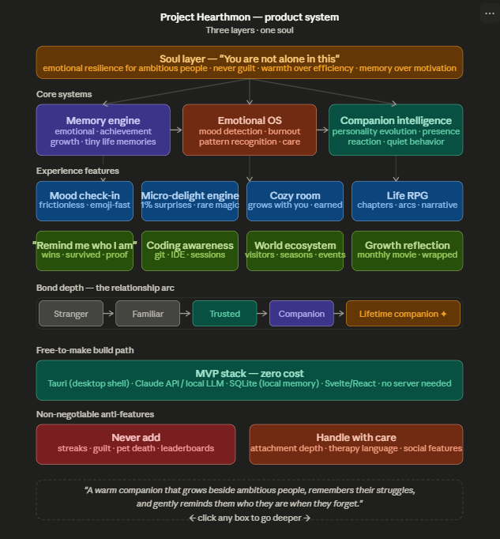

<div align="center">

# 🌟 Hearthmon — You Don't Build Alone

> *A Pokémon-inspired desktop companion that quietly grows beside you while you build. It notices **how** you build, remembers the seasons you lived through, and never once asks for your attention.*

<p align="center">
  
</p>

**Current Companion:** —<br/>
**Mood:** quietly present<br/>
**Status:** *"keeping watch."*<br/>

*↑ This card is **alive** — Hearthmon writes it back into your repo as you build, so your profile breathes.*

`100% local` · `no account` · `no cloud` · `~10 MB native` · `Tauri 2 + Svelte 5 + Rust + Pixi.js v8`

</div>

---

## 🎬 See it in motion

<p align="center">
  <video src="https://github.com/AnshBajpai05/Hearthmon-Trial_Beta/raw/main/demo.mp4" controls muted loop width="750"></video>
</p>

<p align="center"><em>Player not loading? <a href="https://github.com/AnshBajpai05/Hearthmon-Trial_Beta/raw/main/demo.mp4">▶ Watch the demo</a>.</em></p>

---

## ✦ What is Hearthmon?

A Pokémon that lives in the corner of your screen while you code — but it's not a pet that begs for attention, and it's not another productivity tracker. The unusual part:

> **It notices *how* you build, not just *that* you did.**

It feels the texture of a session. It **goes quiet when you drop into flow**, **sits a little closer** when you've been wrestling the same bug for an hour, and celebrates the commit that *finally cracked it* — not the typo-fix. It remembers the **seasons** you lived through — the late nights, the projects you stuck with — and brings them back, gently, weeks later. It keeps watch while your **model trains**. It even quietly updates a **living card on your GitHub profile** as you go.

**No guilt. No streaks. No hustle. No cloud. Just presence.**

---

## ✨ What it feels like

It's 2:14 AM. You've been fighting the same bug for an hour. Your companion quietly shifts a little closer.

No notification. No streak warning. Just:

> *"Still here."*

Weeks later, after you finally ship:

> *"You really fought for this one."*

And on a random Tuesday, out of nowhere:

> *"This is around when we started CNG IntelliFlow. Look how far that's come."*

Hearthmon remembers the hard nights — and stays.

---

## 🌍 The Living World — *the "Alive" renderer*

Hearthmon ships **two skins over one shared brain** (pick on first launch, switch anytime with **V**):

- **Classic** — a cozy, lightweight CSS companion.
- **✦ Alive** — a **living snow-globe** rendered in Pixi.js v8 — your companion floating in a hand-crafted world that reacts to *everything*.

Inside the Alive globe:

- 🪐 **Type Habitats** — the whole world changes with your companion's type: a Moonlit Shore for Water, a Campfire Workshop for Fire, a Neon storm-sky for Electric, a Dream Observatory for Psychic… 10 hand-tuned sanctuaries covering all 18 types, each with its own sky, light, particles, and window silhouette.
- 🌌 **Energized orbital ground** — hundreds of type-tinted stars orbiting the base in concentric rings, a rotating galaxy floor, soft rim-light, and atmospheric depth.
- ⚡ **Chain lightning & a legendary event** — Electric habitats crackle with forked, white-gold chain lightning; on a rare "super-strike" the globe throws 2–3 bolts at once and the ground answers with a multi-strike barrage and a full-field flash. The bolts scale with your companion's power. The kind of moment you screenshot.
- 🫧 **Mesh-warp body** — every one of the 1025 Pokémon gets squash-stretch, jiggle, breathing and lean with **zero per-character rigging**, over live Showdown sprite animation.
- 🌦️ **Ambient life** — fireflies, embers, god-rays, water caustics, snowfall, and real weather (rain / wind / snow / thunder).

> Drag the corner to resize (the pet scales to follow). Drag empty space to move it. It self-heals if your GPU sleeps.

---

## 🧩 Everything it does

### 🌱 Presence & soul *(the real point)*
- **Quiet presence** — sits beside your work, wanders, dozes off when ignored, breathes.
- **Return without shame** — gone for days, weeks, a month? Only warmth, *never* guilt.
- **Bond that's earned** — grows across 6 real stages (Stranger → Familiar → Trusted Friend → Companion → Partner → Lifetime Companion) from genuine time + check-ins. Deeper, more vulnerable lines unlock only as trust grows.
- **Sacred rare moments** — protected, once-ever lines that land *because* they're scarce.
- **Personality drift** — your companion slowly becomes unlike anyone else's, shaped by **how you treat it**, plus stable per-species quirks (night owl, collects stars, hates Mondays…).
- **Companionship modes** — Default · Just-There (fully silent) · Fun (livelier). And **Focus Mode** 🎯: the pet stays, every sound and line goes quiet.

### 🧠 Quiet awareness *(all opt-in, all privacy-safe)*
- **Coding awareness** — point it at a local git folder, a GitHub repo, or your **whole GitHub account**; it reacts to commits, **bug-fixes**, PRs merged, releases, new repos, and commit milestones. Private repos via an optional read-only token (stored locally, never logged).
- **Flow sense** — infers **flow vs. friction vs. breakthrough** from your foreground app **name only** — never titles, keystrokes, screen, or code. Goes silent in deep flow, sits closer when you're stuck, and amplifies the commit that ends a long hard stretch.
- **"Alongside you"** — recognizes the project you keep returning to and honours the ones you stuck with.
- **Training awareness** — point it at a training log; it keeps watch while your model trains, celebrates a finished run, and offers sympathy (never blame) on a crash.
- 🎵 **Vibe with your music** — subtly reacts to your **system audio** (gentle bob, beat pulses, type-flavored sparks); a real musical drop triggers the legendary storm. **No audio is ever recorded or sent — only ephemeral energy numbers.** Off by default.

### 📖 Memory *(memory > motivation)*
- **Mood check-in** (**M**) — six emojis + optional note; the room takes the mood's tint.
- **"We've been here before"** — surfaces a *specific* past mood you've since outlived.
- **Remind Me Who I Am** — proof you're growing: things you survived, things you learned, wins you forgot.
- **Our Journey** 📖 — a scrapbook timeline + a **Constellation** of your memories as a night sky.
- **Memory anniversaries** — "this is around when we started X," surfaced ~a year later as shared memory.
- **Good Things Jar** 🫙 (**J**) · **Leave a note to tomorrow** ✉️ (**N**) · **Memory capsules** (open in a week / month / year) · **"Someone Believed In You"** archive · **The Vault** (emergency comfort pack).
- **Year in Review** & a cinematic **Journey Movie** of your eras. **17 emotional badges** (Still Standing, Builder's Courage, CUDA Survivor…) — never productivity metrics.
- **Gentle, never clinical** — quiet burnout noticing, a "reach out to someone?" nudge after long sessions, a Sunday retrospective, anniversaries with fireworks.

### ⚔️ The fun
- **Full Pokédex (all 1025)** — switch by search, type & generation filters, a random 🎲 picker, or an auto-switch timer. **1/128 shiny** odds. ✨
- **Ash throw ceremony** — recall beam → trainer winds up → *"<Name>, go!"* → the ball arcs in spinning → bursts open. Real Pokémon cries + Ash voice clips.
- **Real movesets & typed attacks** — each mon uses its actual learnset: beams, energy orbs, lightning, earthquakes, slashes.
- **1v1 Battle Arena** — real base stats, the full 18×18 type chart, STAB, crits, speed-based turns, draining HP bars, confetti.
- **Evolution ceremony** — the white-silhouette flicker → reveal, keeping the nickname and every memory.

### 🎂 Little touches
- **Birthday** — tell it yours at the first meeting; it remembers, and celebrates (quietly, once a year).
- **Quiet reminders** ⏰ — set gentle personal nudges ("tea time", "brush again") at a time of day; it surfaces them softly — a nudge, never an alarm.
- **Dreams** — symbolic dream bubbles drawn from your real memories while it sleeps.
- **Living README card** — the animated SVG at the top auto-updates itself into your repo as you build.

---

## 🔒 Privacy — non-negotiable

**100% local. No account. No server. Nothing uploaded — ever.** All memories, moods, and awareness data live in a local SQLite DB at `%APPDATA%/com.hearthmon.app/`. With awareness on, it sees process **names** only — never window titles, keystrokes, your screen, your code, or your audio. Music awareness keeps only ephemeral energy numbers; the raw samples never leave the callback.

---

## 🛠️ Stack

| Layer | Technology | Engineering details |
|---|---|---|
| **Shell & backend** | **Tauri 2 (Rust)** | ~10 MB native footprint. Frameless, transparent, always-on-top window. |
| **UI framework** | **Svelte 5 + SvelteKit** | Fully typed (TypeScript), Vite 6. |
| **Graphics engine** | **Pixi.js v8** | The "Alive" snow-globe: mesh-warp body, custom spring physics, orbital particle fields, dynamic lighting, weather. WebGL context-loss recovery. |
| **Local memory** | **SQLite** | via `tauri-plugin-sql`; WAL + indexed. Never leaves the machine. |
| **Awareness** | **Win32 (`windows-sys`)** | Foreground process **name** sensing — zero keystrokes/titles logged. |
| **Audio** | **cpal** | WASAPI loopback → ephemeral 3-band energy analysis (~30 Hz). |
| **Security** | **Offline crypto** | `chacha20poly1305` + `hkdf` + `hmac` + `obfstr` for device-bound, tamper-resistant trial state. |
| **Data** | **PokéAPI** | Real base stats, 18×18 type chart, actual learnsets, sprites & cries. |

---

## 🏗️ Architecture — one brain, two skins

```text
[ Foreground app name · git reflog · training log · system audio ]
        ↓  (privacy-safe signals only — never content)
[ Awareness layer:  flow / friction / breakthrough / waiting ]
        ↓
[ Memory-driven emotional brain  (SQLite: memories + meta) ]
        ↓                                    ↘
[ Classic renderer (CSS) ]            [ Alive renderer (Pixi.js globe) ]
        ↓                                    ↙
[ Transparent · frameless · always-on-top Tauri window ]
```

The emotional brain is identical across both renderers — strict feature parity, never two apps. No LLM required (an optional local Ollama / Claude layer is on the roadmap, not a dependency).



---

## ⚙️ Quick start

```bash
npm install
npm run tauri dev          # develop
npm run tauri build        # standalone .exe
```

### Controls cheat-sheet
- **Drag empty space** → move · **Click** → perk · **Stroke across it** → pet (hearts)
- **✦ edge trigger** → radial menu (switch Pokémon, Journey, reminders, settings…)
- **V** switch skin (Classic ↔ Alive) · **M** mood · **J** jar · **N** note
- **Alt + Space** → command palette · **Alt + W** → whistle it back to screen center
- **Close button** → hides to the **system tray** (click the tray icon to summon · right-click → Quit)

> Doesn't start on its own by default — you run the exe. Flip **"Start with Windows"** in settings if you want it at login (it asks before popping up).

---

## 📁 Repository structure

```text
.
├── src/               # SvelteKit UI, the emotional brain, both renderers
├── src-tauri/         # Rust backend: window, watchers, audio, chapter gate
├── static/            # assets, voice clips, fallback sprites
├── assets/            # the living README card (auto-generated SVG)
├── docs/              # VISION.txt, SOUL.md, product map, design notes
├── tools/             # voice + data pipelines
└── README.md          # you are here
```

---

## ⚠️ Notes & limits

- **Windows-first** (Tauri 2 + WebView2 + WASAPI / Win32 awareness). macOS/Linux build the shell, but awareness/music are Windows-specific today.
- On the Alive globe, if the **GPU sleeps during long idle** the WebGL canvas can blank — Hearthmon now detects context loss and **remounts itself** automatically.
- Sprites, cries, names, and any supplied/cloned voice audio are Nintendo / The Pokémon Company / voice-actor IP.

---

## 🔮 Vision

A companion that outlasts the machines it runs on — a quiet friend that holds the history of everything you've ever built, and reminds you of the builder you are.

---

## 🏗️ Builders

<!--BUILDERS:START-->
✦ Hearthmon is quietly finding its first builders.
<!--BUILDERS:END-->

_Want a longer chapter? The first one's free — reach out for a builder pass. (Updated by hand from passes issued; nothing phones home.)_

---

### License & use

Personal project. Pokémon sprites, cries, names, and any supplied/cloned voice audio are Nintendo / The Pokémon Company / voice-actor IP — **personal use only, never redistribute.**

🤖 Built with [Claude Code](https://claude.com/claude-code) & ❤️ by **Ansh Bajpai** ([@AnshBajpai05](https://github.com/AnshBajpai05)).
*If it stays beside you — let Ansh know. 🌙*
